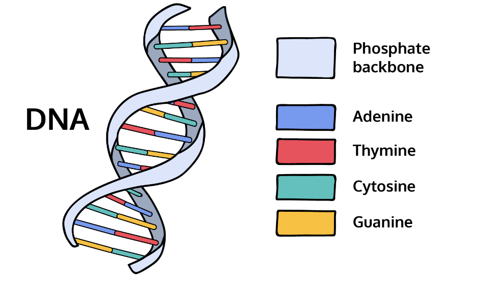

# DNA Sequencing

The genome of an organism stores all the genetic information necessary to build and maintain that organism. It is an organism’s complete set of DNA.

[DNA](https://en.wikipedia.org/wiki/DNA) is composed of a series of nucleotides abbreviated as:

- `A`: Adenine
- `C`: Cytosine
- `G`: Guanine
- `T`: Thymine

So a strand of DNA could look something like `ACGAATTCCG`.

Write a **DNA.java** program that determines whether there is a protein in a strand of DNA.

A protein has the following qualities:

It begins with a “start codon”: `ATG`.
It ends with a “stop codon”: `TGA`.
In between, each additional codon is a sequence of three nucleotides.
So for example:

- `ATGCGATACTGA` is a protein because it has the start codon `ATG`, the stop codon `TGA`, and the length is divisible by 3.
- `ATGCGATAGA` is not a protein because the sequence length is not divisible by 3, so the third condition is not satisfied.

## Tasks

### String methods

1. 
| string methods | value |
| ------------ | -------- |
| `length()` | returns the length |
| `concat()` | concatenates two strings |
| `equals()` | checks for equality between two strings |
| `indexOf()` | returns the index of a substring |
| `charAt()` | returns a character |
| `substring()` | returns a substring |
| `toUpperCase()` | returns the upper case version |
| `toLowerCase()` | returns the lower case version |

### Setting up

2. 
Let’s create a skeleton for the program. Add the following into **DNA.java**:

    public class DNA {
    
    public static void main(String[] args) {
    
        //  -. .-.   .-. .-.   .
        //    \   \ /   \   \ / 
        //   / \   \   / \   \  
        //  ~   `-~ `-`   `-~ `-
    
    }
    
    }

3. 
Write a comment near the top of the program that describes what the program does.

4. 
Here are the three DNA strands that you are going to use to test your program:

- `"ATGCGATACGCTTGA"`
- `"ATGCGATACGTGA"`
- `"ATTAATATGTACTGA"`

Store them in different strings: `dna1`, `dna2`, and `dna3`.

### Find the length

5. 
Create a generic `String` variable called `dna` that can be set to any DNA sequence (`dna1`, `dna2`, `dna3`).

6. 
To warm up, find the length of the `dna` string.

### Find the start codon and stop codon

7. 
Remember that a protein has the following qualities:

1. It begins with a start codon `ATG`.
2. It ends with a stop codon `TGA`.
3. In between, the number of nucleotides is divisible by 3.

First, let’s start with the first condition. Does the DNA strand have the start codon `ATG` within it?

Find the index where `ATG` begins using `indexOf()`.

8. 
Next, does the DNA strand have the stop codon `TGA`?

Find the index where `TGA` begins.

### Find the protein

9. 
Lastly, you’ll find out whether or not there is a protein!

Let’s start with an `if` statement that checks for a start codon and a stop codon using the `&&` operator.

Remember that the `indexOf()` string method will return `-1` if the substring doesn’t exist within a `String`.

10. 
Add a third condition that checks whether or not that the number of nucleotides in between the start codon and the stop condon is a multiple of 3.

Remember that the modulo operator `%` returns the remainder of a division.

11. 
Inside the `if` statement, create a `String` variable named `protein`.

And find this protein in the `dna` by using the `substring()` string method. Think about where you want the substring to begin and where you want the substring to end.

Remember that a codon is 3 nucleotides long.

12. 
Add an `else` clause that prints out `No protein.`.

13. 
You are all done!

Let’s test your code with each DNA strand. These should be the results:

- `dna1`: Contains a protein.
- `dna2`: Does not contain a protein.
- `dna3`: Contains a protein.
