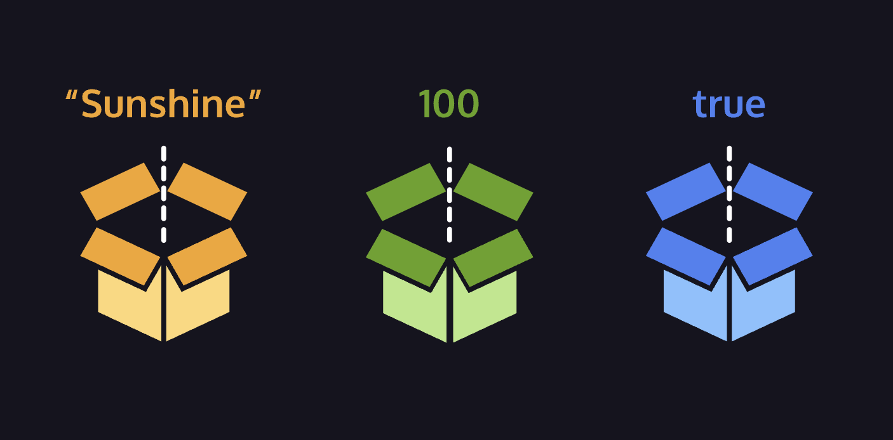

(From Codecademy's "Learn JavaScript" course, Introduction Unit:
https://www.codecademy.com/courses/introduction-to-javascript)

# Variables

In programming, a variable is a container for a value. You can think of variables as little containers for information that live in a computer’s memory. Information stored in variables, such as a username, account number, or even personalized greeting can then be found in memory.

Variables also provide a way of labeling data with a descriptive name, so our programs can be understood more clearly by the reader and ourselves.

In short, variables label and store data in memory. There are only a few things you can do with variables:

1. Create a variable with a descriptive name.
2. Store or update information stored in a variable.
3. Reference or “get” information stored in a variable.

It is important to distinguish that variables are not values; they contain values and represent them with a name. Observe the diagram with the colored boxes. Each box represents variables; the values are represented by the content, and the name is represented with the label.

In this lesson, we will cover how to use the var, let, and const keywords to create variables.

#### Create a Variable: var

There were a lot of changes introduced in the ES6 version of JavaScript in 2015. One of the biggest changes was two new keywords, let and const, to create, or declare, variables. Prior to the ES6, programmers could only use the var keyword to declare variables.

        var myName = 'Arya';
        console.log(myName);
        // Output: Arya

Let’s consider the example above:

1. `var`, short for variable, is a JavaScript keyword that creates, or declares, a new variable.
2. `myName` is the variable’s name. Capitalizing in this way is a standard convention in JavaScript called camel casing. In camel casing you group words into one, the first word is lowercase, then every word that follows will have its first letter uppercased. (e.g. camelCaseEverything). 3.`=` is the assignment operator. It assigns the value (`'Arya'`) to the variable (`myName`).
3. `'Arya'` is the value assigned (`=`) to the variable `myName`. You can also say that the `myName` variable is initialized with a value of `'Arya'`.
4. After the variable is declared, the string value 'Arya' is printed to the console by referencing the variable name: console.log(myName).

There are a few general rules for naming variables:

- Variable names cannot start with numbers.
- Variable names are case sensitive, so `myName` and `myname` would be different variables. It is bad practice to create two variables that have the same name using different cases.
- Variable names cannot be the same as keywords. For a comprehensive list of keywords check out [MDN’s keyword documentation](https://developer.mozilla.org/en-US/docs/Web/JavaScript/Reference/Lexical_grammar#Keywords).

In the next exercises, we will learn why ES6’s `let` and `const` are the preferred variable keywords by many programmers. Because there is still a ton of code written prior to ES6, it’s helpful to be familiar with the pre-ES6 var keyword.

If you want to learn more about `var` and the quirks associated with it, check out the [MDN var documentation](https://developer.mozilla.org/en-US/docs/Web/JavaScript/Reference/Statements/var).

##### Instructions:

1. Declare a variable named `favoriteFood` using the `var` keyword and assign to it the string `'pizza'`.
2. Declare a variable named `numOfSlices` using the `var` keyword and assign to it the number `8`.
3. Under the `numOfSlices` variable, use `console.log()` to print the value saved to `favoriteFood`.
4. On the following line, use `console.log()` to print the value saved to `numOfSlices`.

#### Create a Variable: let

As mentioned in the previous exercise, the `let` keyword was introduced in ES6. The `let` keyword signals that the variable can be reassigned a different value. Take a look at the example:

        let meal = 'Enchiladas';
        console.log(meal); // Output: Enchiladas
        meal = 'Burrito';
        console.log(meal); // Output: Burrito

Another concept that we should be aware of when using `let` (and even var) is that we can declare a variable without assigning the variable a value. In such a case, the variable will be automatically initialized with a value of undefined:

        let price;
        console.log(price); // Output: undefined
        price = 350;
        console.log(price); // Output: 350

Notice in the example above:

- If we don’t assign a value to a variable declared using the `let` keyword, it automatically has a value of undefined.
- We can reassign the value of the variable.

##### Instructions:

1. Create a `let` variable called `changeMe` and set it equal to the boolean `true`.
2. On the line after `changeMe` is declared, set the value of `changeMe` to be the boolean false.
3. To check if `changeMe` was reassigned, log the value saved to `changeMe` to the console.

#### Create a Variable: const

The `const` keyword was also introduced in ES6, and is short for the word constant. Just like with var and let you can store any value in a `const` variable. The way you declare a `const` variable and assign a value to it follows the same structure as let and var. Take a look at the following example:

        const myName = 'Gilberto';
        console.log(myName); // Output: Gilberto

However, a `const` variable cannot be reassigned because it is constant. If you try to reassign a `const` variable, you’ll get a TypeError.

Constant variables must be assigned a value when declared. If you try to declare a `const` variable without a value, you’ll get a `SyntaxError`.

If you’re trying to decide between which keyword to use, `let` or `const`, think about whether you’ll need to reassign the variable later on. If you do need to reassign the variable use `let`, otherwise, use `const`.

##### Instructions:

1. Create a constant variable named `entree` and set it to equal to the string `'Enchiladas'`.
2. Just to check that you’ve saved the value of `'Enchiladas'` to `entree`, log the value of `entree` to the console.
3. Great, let’s see what happens if you try to reassign a constant variable.

Paste the following code to the bottom of your program.

       entree = 'Tacos'

This code throws the following error when you run your code:

    TypeError: Assignment to constant variable.

#### Mathematical Assignment Operators

Let’s consider how we can use variables and math operators to calculate new values and assign them to a variable. Check out the example below:

    let w = 4;
    w = w + 1;

    console.log(w); // Output: 5

In the example above, we created the variable `w` with the number `4` assigned to it. The following line, `w = w + 1`, increases the value of w from `4` to `5`.

Another way we could have reassigned w after performing some mathematical operation on it is to use built-in mathematical assignment operators. We could re-write the code above to be:

    let w = 4;
    w += 1;

    console.log(w); // Output: 5

In the second example, we used the `+=` assignment operator to reassign `w`. We’re performing the mathematical operation of the first operator `+` using the number to the right, then reassigning `w` to the computed value.

We also have access to other mathematical assignment operators: `-=`,` *=`, and `/=` which work in a similar fashion.

    let x = 20;
    x -= 5; // Can be written as x = x - 5
    console.log(x); // Output: 15

    let y = 50;
    y *= 2; // Can be written as y = y * 2
    console.log(y); // Output: 100

    let z = 8;
    z /= 2; // Can be written as z = z / 2
    console.log(z); // Output: 4

Let’s practice using these mathematical assignment operators!

##### Instructions:

Code:

    let levelUp = 10;
    let powerLevel = 9001;
    let multiplyMe = 32;
    let quarterMe = 1152;

    // Use the mathematical assignments in the space below:

    levelUp += 5;
    powerLevel -= 100;
    multiplyMe *= 11;
    quarterMe /= 4;

    // These console.log() statements below will help you check the values of the variables.
    // You do not need to edit these statements.
    console.log('The value of levelUp:', levelUp);
    console.log('The value of powerLevel:', powerLevel);
    console.log('The value of multiplyMe:', multiplyMe);
    console.log('The value of quarterMe:', quarterMe);

1. Use the `+=` mathematical assignment operator to increase the value stored in `levelUp` by `5`.
2. Use the `-=` mathematical assignment operator to decrease the value stored in `powerLevel` by `100`.
3. Use the `*=` mathematical assignment operator to multiply the value stored in `multiplyMe` by `11`.
4. Use the `/=` mathematical assignment operator to divide the value stored in `quarterMe` by `4`.

#### String Concatenation with Variables

In previous exercises, we assigned strings to variables. Now, let’s go over how to connect, or concatenate, strings in variables.

The `+` operator can be used to combine two string values even if those values are being stored in variables:

        let myPet = 'armadillo';
        console.log('I own a pet ' + myPet + '.');
        // Output: 'I own a pet armadillo.'

In the example above, we assigned the value `'armadillo'` to the `myPet` variable. On the second line, the `+` operator is used to combine three strings: `'I own a pet'`, the value saved to `myPet`, and `'.'`. We log the result of this concatenation to the console as:

        I own a pet armadillo.

##### Instructions:

1. Create a variable named `favoriteAnimal` and set it equal to your favorite animal.
2. Use `console.log()` to print `'My favorite animal: ANIMAL'` to the console. Use string concatenation so that `ANIMAL` is replaced with the value in your `favoriteAnimal` variable.

#### typeof operator

While writing code, it can be useful to keep track of the data types of the variables in your program. If you need to check the data type of a variable’s value, you can use the `typeof` operator.

The `typeof` operator checks the value to its right and _returns_, or passes back, a string of the data type.

    const unknown1 = 'foo';
    console.log(typeof unknown1); // Output: string

    const unknown2 = 10;
    console.log(typeof unknown2); // Output: number

    const unknown3 = true;
    console.log(typeof unknown3); // Output: boolean

Let’s break down the first example. Since the value `unknown1` is `'foo'`, a string, `typeof unknown1` will return `'string'`.

##### Instructions:

Code:

    let newVariable = 'Playing around with typeof.';

1. Use `console.log()` to print the `typeof newVariable`.
2. Great, now let’s check what happens if we reassign the variable. Below the `console.log()` statement, reassign `newVariable` to `1`.
3. Since you assigned this new value to `newVariable`, it has a new type! On the line below your reassignment, use `console.log()` to print `typeof newVariable` again.

#### Review Variables

Nice work! This lesson introduced you to variables, a powerful concept you will use in all your future programming endeavors.

Let’s review what we learned:

- Variables hold reusable data in a program and associate it with a name.
- Variables are stored in memory.
- The `var` keyword is used in pre-ES6 versions of JS.
- `let` is the preferred way to declare a variable when it can be reassigned, and `const` is the preferred way to declare a variable with a constant value.
- Variables that have not been initialized store the primitive data type `undefined`.
- Mathematical assignment operators make it easy to calculate a new value and assign it to the same variable.
- The `+` operator is used to concatenate strings including string values held in variables.
- In ES6, template literals use backticks `` ` `` and `${}` to interpolate values into a string.
- The `typeof` keyword returns the data type (as a string) of a value.

##### Instructions:

To learn more about variables take on these challenges!

- Create variables and manipulate the values.
- Check what happens when you try concatenating strings using variables of different data types.
- Interpolate multiple variables into a string.
- See what happens when you use console.log() on variables declared by different keywords (`const`, `let`, `var`) before they’re defined.

For example:

        console.log(test1);

        const test1 = 'figuring out quirks';

- Find the data type of a variable’s value using the `typeof` keyword on a variable.
- Use `typeof` to find the data type of the resulting value when you concatenate variables containing two different data types.
